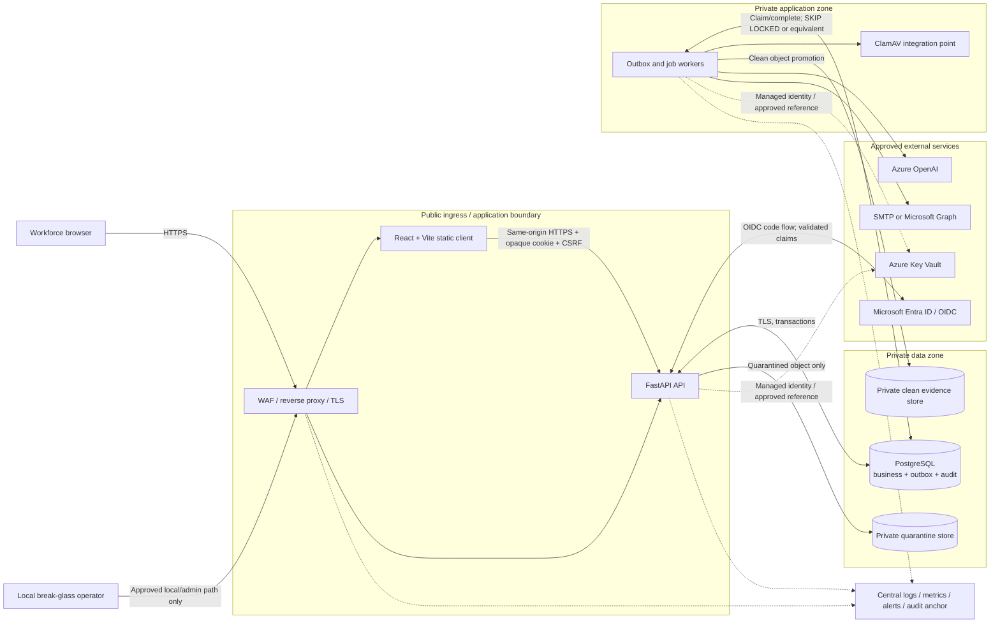
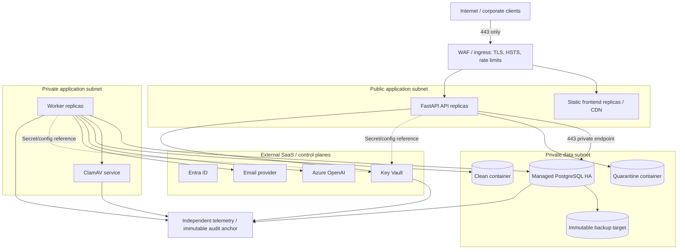
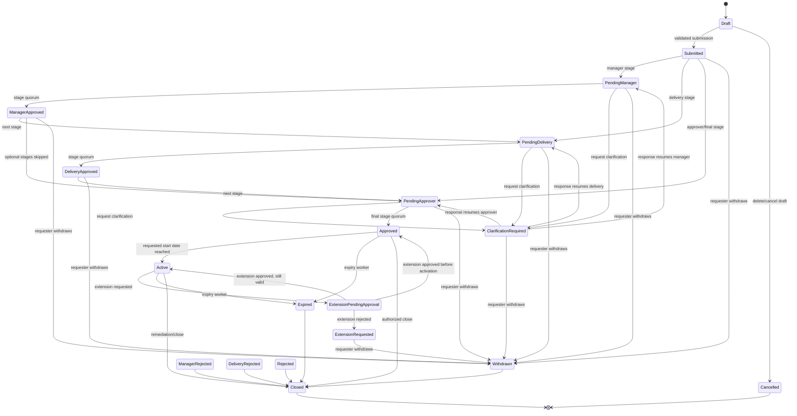
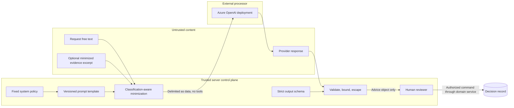

# Architecture

## 1. Status and system purpose

This is a target architecture informed by the static source snapshot. No release-linked implementation, integration, test, deployment, or acceptance evidence was supplied; observed code is not proof that a component is complete or production-ready.

The platform records bounded requests to deviate from an enterprise control, collects evidence, routes review and approval, attaches a validity period, preserves an auditable decision history, and notifies assigned participants. An approved request represents an authorization record; it does not automatically modify a target system. Any control remediation or entitlement change requires a separate, authorized system integration.

## 2. Assumptions requiring approval

| ID | Assumption | Consequence / decision needed |
|---|---|---|
| A-01 | The service is an internal, single-enterprise exception register. | Confirm legal purpose, data owner, and whether approved exceptions must be consumed by other systems. |
| A-02 | Microsoft Entra ID is the normal workforce identity provider. | Confirm tenant(s), app registration ownership, app-role claim names, Conditional Access, and support model. |
| A-03 | A requester cannot be the final approver for their own request. | Confirm any documented emergency delegation and whether two approvers are required above a risk threshold. |
| A-04 | Attachments are supporting evidence, not executable or automatically trusted content. | Confirm maximum size/count/types, accepted classifications, retention, DLP, and whether text extraction is ever allowed. |
| A-05 | Azure OpenAI advice is optional and never authoritative. | Confirm approved use cases, region/deployment, provider retention, data residency, and whether absence of advice blocks submission or only approval as a procedural task. |
| A-06 | Email is asynchronous convenience, not the system of record. | Confirm provider (SMTP or Graph), sender domain, recipient sources, and escalation channel. |
| A-07 | PostgreSQL is the authoritative relational store. | Confirm managed service, HA topology, PITR, region, encryption, maintenance window, and connection limits. |
| A-08 | Object storage and ClamAV are separate trust zones from the API. | Confirm quarantine/clean/archive containers, private networking, scanner engine/signatures, and availability objective. |
| A-09 | The initial deployment is one region and one tenant. | If false, add tenant keys/RLS/isolation and revise backup, residency, and per-tenant audit-chain anchoring before design approval. |
| A-10 | The expected load and data volumes are not yet supplied. | Benchmark and size API/worker/database before choosing replica and queue limits. |
| A-11 | RPO, RTO, availability, retention, and deletion periods are not yet approved. | These are release blockers, not implementation defaults. |
| A-12 | A compute runtime is not selected. | Azure App Service, Container Apps, AKS, or another approved runtime may implement this topology; security and operations requirements are runtime-independent. |

## 3. Actors, roles, and separation of duties

Role claims establish coarse eligibility; the backend still evaluates permission, resource scope, workflow state, and separation-of-duties rules.

The static source currently seeds `user`, `approver`, and `admin` roles. The target enterprise model below separates Reviewer and Auditor duties. Until migrations, RBAC policy, and tests implement that split, treat all privileged review/access as `approver` or wildcard `admin` capability and do **not** claim independent-auditor enforcement.

| Actor / role | Normal authentication | Allowed capabilities | Explicit restrictions |
|---|---|---|---|
| Requester | Entra ID | Create a draft; read own permitted requests/advice; edit allowed draft fields; submit; withdraw while allowed; upload allowed evidence; respond to requested changes | Cannot approve/reject own request; cannot assign privileged roles; cannot see unrelated restricted evidence |
| Reviewer | Entra ID | Read assigned/authorized requests; start review; request changes; comment/recommend; inspect clean evidence | Cannot make final decision unless a separately approved role also grants it; cannot alter audit |
| Approver | Entra ID | Read assigned/authorized requests; approve or reject within delegated policy; revoke approved exception when authorized | Cannot decide own request; cannot bypass mandatory fields/checks; no role administration |
| Auditor | Entra ID | Read approved audit/history/exports; verify chain and evidence; inspect security events | No business mutation; exports are sensitive and audited |
| Administrator | Entra ID | Manage approved user status, role assignments, policy metadata, and operational configuration | No self-approval; no routine break-glass use; no audit deletion/rewrite; no arbitrary data correction |
| Worker/service identity | Workload identity / managed identity where supported | Claim outbox, run approved jobs, call allowlisted integrations, record job/delivery outcomes | No interactive login, no browser session, no role impersonation, no arbitrary URL/tool execution |
| Break-glass administrator | Separate local path, unique identity, MFA | Time-bounded emergency access and explicitly approved recovery actions | Disabled by default; never an OIDC fallback; every attempt/action audited and alerted; no shared account; two-person enablement recommended |
| Notification recipient | Destination derived from current assignment/role | Receives a link and minimal event summary | Email possession grants no application access |

### Approval invariants

1. The requester identity, final decision actor, and any delegated exception approver are recorded separately.
2. A final decision must reference the exact request version and satisfy current policy requirements.
3. Administrator and break-glass identities cannot self-approve.
4. Role changes do not retroactively authorize historical actions.
5. A removed or disabled user’s sessions are revoked; historical authorship remains.

## 4. Logical component architecture

| Component | Intended path / deployment | Responsibility | Must not do |
|---|---|---|---|
| React/Vite client | `frontend/src/`; static assets | Render accessible UI, collect bounded input, send same-origin requests, display safe advice | Store tokens/secrets, enforce authorization, call data/AI/ClamAV services directly, render model HTML |
| FastAPI API | `backend/app/api/routes/`, `backend/app/core/` | OIDC callback, session, CSRF, authorization, validation, rate limits, API contracts, error handling | Trust UI decisions, hold business state outside DB transactions, expose integration credentials |
| Domain/workflow service | `backend/app/services/` | State machine, separation of duties, decision policy, domain events, AI orchestration | Bypass repository transactions or permit AI output to decide |
| Relational model/session | `backend/app/models/`, `backend/app/db/` | SQLAlchemy mappings, PostgreSQL constraints/transactions, outbox and audit persistence | Use SQLite in production, allow update/delete on audit rows |
| Integrations | `backend/app/integrations/` is the target boundary; static provider logic currently resides in `backend/app/services/authentication.py`, `files.py`, `email.py`, `ai.py`, and `backups.py` | Entra ID metadata, object storage, ClamAV, email, Azure OpenAI, Key Vault adapters | Accept user-controlled destinations, log secrets, retry forever, assume provider data is trusted |
| Transactional jobs/workers | `backend/app/services/outbox.py`, `backend/app/workers/run.py`, `background_jobs` table | Durable idempotent job/event processing, notifications, scan jobs, AI jobs, retries/failures | Act before commit, process privileged browser input, use shared manual database credentials |
| Alembic migrations | `backend/alembic/versions/` | Versioned PostgreSQL schema | Contain destructive auto-applied production changes |
| Automated tests | `backend/tests/`, future frontend test paths | Unit, integration, contract, adversarial, migration, and recovery evidence | Depend only on mocks for release-critical integration claims |
| Local runtime data | `storage/attachments/`, `storage/backups/`, `storage/exports/` | Developer-only isolated runtime paths | Contain committed production/backup data or be an authoritative production store |

## 5. Component diagram



The diagram is a logical view, not a claim that any runtime or managed service has been deployed.

## 6. Deployment architecture



### Observed local container baseline

`docker-compose.yml` defines PostgreSQL, ClamAV, a FastAPI image that also serves the built React frontend, and a worker with a shared application-storage volume. It is a **local/integration topology only**: it publishes a configurable loopback port by default, uses development environment injection, and has no private network/WAF, managed HA/PITR, object store, Key Vault, external identity, or production observability. `Dockerfile` runs as a non-root application user and does not trust arbitrary forwarded headers by default.

### Deployment controls

- Only the edge/ingress accepts public traffic. PostgreSQL, object storage, ClamAV, workers, and Key Vault data-plane endpoints are not public.
- API and worker images come from the same reviewed release but run with different least-privilege identities.
- Outbound destinations are allowlisted. Model, email, IdP metadata, scanner, and storage endpoints are configuration-controlled, not request-controlled.
- Health endpoints disclose minimal status. Readiness includes only dependencies required to serve safely; liveness does not fail because an optional AI/email provider is down.
- Resource limits protect request parsing, uploads, concurrency, model calls, jobs, and database pools. Load tests establish values rather than relying on defaults.
- Database migrations run as a single controlled release job after backward-compatible application deployment, not independently on every replica.
- At least the API, worker, database, storage, and scanner recovery modes are exercised. The exact replica count and managed-service SLA depend on approved availability objectives.
- No production data is written under repository `storage/` paths. Local filesystem storage is a development adapter only.

## 7. Trust boundaries

| Boundary | Less-trusted side | Trusted side | Mandatory controls |
|---|---|---|---|
| TB-01 Internet to edge | Browser, network attacker | WAF/ingress | TLS, HSTS, request limits, bot/abuse controls, no token in URL |
| TB-02 Edge to application | Untrusted HTTP input | FastAPI | Schema validation, encoding, CSRF, authn/authz, rate limits, safe errors |
| TB-03 Application to data | Application request | PostgreSQL/object store | Private network, workload identity, least privilege, TLS, parameter-bound SQL, encryption |
| TB-04 Application to worker | Committed domain event | Worker | Signed/authenticated transport if remote, stable event ID, idempotency, schema version, least privilege |
| TB-05 IdP to application | External token/metadata | Session/role mapper | Signature/issuer/audience/nonce/time validation, tenant pinning, no arbitrary group-to-role mapping |
| TB-06 Content to scanner/AI | User text and files | ClamAV/Azure OpenAI | Quarantine, exact-checksum scan binding, minimized AI input, no raw file by default, prompt/output isolation |
| TB-07 SaaS to application | Email bounce, model output, provider response | Domain/audit services | Treat as untrusted data; validate contracts; never infer authorization from provider text |
| TB-08 Operators to production | Admin/break-glass actions | Data plane | JIT/time-bounded access, dual approval for high-risk operations, MFA, immutable audit, peer review |
| TB-09 Application to control plane | Workload identity request | Key Vault/config | Managed identity, narrow RBAC, secret versioning/rotation, no broad subscription rights |

## 8. Exception request workflow

### State machine



`Approved` is an authorized future/current interval; `Active` means the start date has been reached. Workflow configuration selects manager, delivery-head, exception-approver, and final stages, so legal paths are validated against the selected ordered stages. Reopening or editing approved history is not permitted; a new request/version cycle and explicit ADR are required if that product behavior changes.

### Transactional command flow

```mermaid
sequenceDiagram
    autonumber
    participant B as Browser
    participant A as FastAPI
    participant P as PostgreSQL
    participant W as Outbox worker
    participant N as Notification adapter
    participant AI as Advisory job
    participant S as Audit anchor/monitor

    B->>A: Command + CSRF + Idempotency-Key + expected version
    A->>A: Authenticate, authorize, validate, check state/SoD
    A->>P: BEGIN
    A->>P: Lock/read request; write transition, decision, audit event, outbox event
    P-->>A: COMMIT atomically
    A-->>B: Sanitized result + new version
    W->>P: Claim committed outbox event
    par Notification side effect
        W->>N: Send minimized idempotent message
        N-->>W: Provider result
    and Optional advisory side effect
        W->>AI: Bounded, sanitized advisory request
        AI-->>W: Untrusted schema-validated output or failure
    end
    W->>P: Record attempt/outcome and audit
    P->>S: Export/anchor protected audit evidence
```

No worker sends a notification or invokes AI before the domain transaction commits. A worker failure cannot roll back an accepted workflow command; it remains visible for retry/dead-letter handling.

## 9. File quarantine workflow

```mermaid
stateDiagram-v2
    [*] --> Requested
    Requested --> Quarantined: size/type checks; random key
    Quarantined --> Scanning: committed scan job
    Scanning --> Clean: exact object version is clean
    Scanning --> Blocked: infected / unsupported / invalid result
    Scanning --> ScanError: timeout / unavailable / engine error
    ScanError --> Scanning: bounded retry
    ScanError --> Blocked: retry exhausted or stale
    Clean --> Available: authorized promotion
    Blocked --> [*]
    Available --> [*]
```



- Malware scanning blocks availability, not the business transaction that records a pending attachment.
- Promotion uses server-side identity to a separate clean container and binds the scan result to cryptographic checksum and object version.
- A changed object requires a new scan; prior `clean` evidence cannot be reused.
- Operator handling of infected content follows the incident/data procedure. Raw content is not copied into email, AI, logs, or routine exports.

## 10. Transactional outbox and notification design

### Outbox invariants

The static source implements the durable queue as `background_jobs` rows created by `backend/app/services/outbox.py` in the caller’s database transaction; there is no separate broker. Treat that table as the transactional job/outbox boundary. Production design may split an immutable event from execution state, but it must preserve the atomicity and compatibility rules below.

1. The outbox/job row and domain change share one PostgreSQL transaction.
2. Events use immutable IDs, schema versions, aggregate IDs, occurrence time, correlation/causation IDs, and a minimal typed payload.
3. A worker claims with database-safe concurrency (`FOR UPDATE SKIP LOCKED` or an approved equivalent), records leases/attempts, and may finish at least once.
4. Every side effect has a stable idempotency key such as `event_id + destination + message_type`; duplicates are expected and harmless.
5. Retry uses bounded exponential backoff with jitter. Dead-letter records are queryable by operators; replay creates a new audited attempt and never edits the original.
6. Events contain object/request IDs and approved summaries, not secrets, raw attachments, model output, or unnecessary sensitive text.
7. Event schemas are versioned. Consumers tolerate unknown fields and reject unsupported major versions to a visible failure path.

### Event and recipient matrix

| Event family | Typical recipients | Content rule | Non-delivery behavior |
|---|---|---|---|
| `exception.request.submitted.v1` | Assigned reviewers/approvers | Request ID, policy/scope summary, due time, portal link | Retry/DLQ; state remains submitted |
| `exception.request.changes_requested.v1` | Requester | Reason category, comment link, due time | Retry/DLQ; reviewers can see workflow alert in-app |
| `exception.request.approved.v1` / `rejected.v1` | Requester, relevant approvers/auditors | Decision, actor display reference, validity, portal link | Retry/DLQ; decision remains authoritative in DB |
| `exception.request.revoked.v1` / `expired.v1` | Requester, relevant approvers/auditors | Reason category, effective time, portal link | Retry/DLQ; expiry is scheduler-driven independently |
| `exception.attachment.scan_completed.v1` | Requester/reviewer when clean or blocked | Filename-safe label, status, link or incident reference | Retry/DLQ; file remains unavailable on ambiguity |
| `exception.advice.completed.v1` | Requester/reviewer when authorized | Advisory status and portal link only | Retry/DLQ; human workflow continues without advice |
| `identity.break_glass.*` / `security.*` | Security/operations responders | Minimal security metadata and incident reference | Page fallback; event remains in protected audit |

Email is never the only copy of a reason, decision, or evidence. A communication-preference opt-out must not suppress legally or operationally required security notices unless policy explicitly allows a separate channel.

## 11. Azure OpenAI advisory boundary



The model has no network, database, storage, email, shell, or workflow tool. User content cannot select a model, endpoint, system instruction, or schema. Schema failure is an advisory failure, not a decision. Raw prompt/response logging is limited to 24 hours; structured, minimized advice may follow the exception record’s approved retention policy. See `04-security-and-risk.md` for the complete control and privacy boundary.

## 12. External integration behavior

| Integration | Direction | Timeout/circuit rule | Data rule | Audit/monitoring |
|---|---|---|---|---|
| Entra ID | Browser redirect and backend OIDC callback/metadata | No silent local fallback; bounded callback | Exact issuer/audience/tenant; minimal claims | Login success/failure, callback rejection, group/version changes |
| PostgreSQL | API/worker | Fail request/job rather than commit partial state | Parameterized SQL, private TLS, least privilege | Query latency/errors, pool saturation, migration, lock, backup/audit status |
| Object storage | API/worker | Abort or leave blocked; do not expose partial upload | Private encryption, random key, classification, checksum | Upload/promotion/download/error, storage access logs |
| ClamAV | Worker | Bounded retry then block/dead-letter | Send only quarantined object; signature freshness required | Engine/signature version, verdict hash, timing, error |
| Email provider | Worker | Retry; stable idempotency; DLQ | No secrets/raw attachments/restricted text | Message ID, template version, result; redacted content sample in controlled evidence |
| Azure OpenAI | Worker | Bounded retry/cost; advice failure does not authorize | Minimized text; no raw attachments; approved region/deployment | Model/prompt/schema version, tokens/cost, validation, 24-hour deletion |
| Key Vault | Workload/control plane | Fail closed for required secrets; bounded cache/refresh | No long-lived developer credential; least-privilege role | Access/rotation failures; access logs exported |

## 13. Architecture decisions still required

Before detailed implementation sign-off, record approved decisions for runtime, managed database/object storage, scanner hosting, email provider, identity-claim mapping, AI region/deployment, data classification/retention, tenant model, RPO/RTO, availability, DR region strategy, and audit external anchor. An unresolved item is a `G` gap when it affects a `P0` production gate.
