# Data and API specification

## 1. Status and data principles

This is the required logical PostgreSQL model and API contract, cross-checked against the static source in `backend/app/models/entities.py` and `backend/app/api/routes/`. It does not claim that the source is complete, migrated, executable, or verified for a release.

The relational model is the system of record. Core business data is normalized to remove repeating columns and update anomalies. Flexible, non-authoritative artifacts may use bounded JSON only where doing so does not replace searchable relationships, permissions, decisions, or audit facts. Every authorization-relevant scope field must be queryable and enforceable by the service/database, not hidden in model output or an opaque token.

## 2. Normalized ERD

```mermaid
erDiagram
    USERS {
        uuid id PK
        string oidc_subject UK
        string display_name
        string status
        timestamp created_at
    }

    ROLES {
        uuid id PK
        string code UK
        string status
    }

    PERMISSIONS {
        uuid id PK
        string code UK
        string description
    }

    USER_ROLES {
        uuid user_id FK
        uuid role_id FK
        timestamp valid_from
        timestamp valid_until
    }

    ROLE_PERMISSIONS {
        uuid role_id FK
        uuid permission_id FK
    }

    SESSIONS {
        uuid id PK
        uuid user_id FK
        string token_hash UK
        timestamp expires_at
        timestamp revoked_at
    }

    POLICY_DEFINITIONS {
        uuid id PK
        string policy_key UK
        int version
        string status
    }

    EXCEPTION_REQUESTS {
        uuid id PK
        uuid requester_id FK
        string state
        int version
        text justification
        timestamp valid_from
        timestamp valid_until
        timestamp created_at
    }

    REQUEST_POLICIES {
        uuid request_id FK
        uuid policy_id FK
        string applicability
    }

    REQUEST_ASSIGNMENTS {
        uuid request_id FK
        uuid assignee_id FK
        uuid assigned_by FK
        string assignment_type
        timestamp assigned_at
    }

    REQUEST_CONDITIONS {
        uuid id PK
        uuid request_id FK
        string condition_type
        string condition_value
    }

    ATTACHMENTS {
        uuid id PK
        uuid request_id FK
        string storage_key
        string checksum_sha256
        string scan_state
        bigint byte_size
        string media_type
    }

    SCAN_RESULTS {
        uuid id PK
        uuid attachment_id FK
        string verdict
        string engine_version
        string signature_version
        timestamp scanned_at
    }

    WORKFLOW_TRANSITIONS {
        uuid id PK
        uuid request_id FK
        uuid actor_id FK
        string from_state
        string to_state
        int request_version
        timestamp occurred_at
    }

    DECISIONS {
        uuid id PK
        uuid request_id FK
        uuid actor_id FK
        string decision
        text rationale
        int request_version
        timestamp decided_at
    }

    AI_ADVICE {
        uuid id PK
        uuid request_id FK
        string model_deployment
        string prompt_version
        string schema_version
        string risk_level
        string disposition
        timestamp generated_at
    }

    AI_ADVICE_FINDINGS {
        uuid id PK
        uuid advice_id FK
        int sequence_no
        string finding_type
        string message
    }

    OUTBOX_EVENTS {
        uuid id PK
        string aggregate_type
        uuid aggregate_id
        string event_type
        int schema_version
        json payload
        timestamp occurred_at
    }

    JOB_EXECUTIONS {
        uuid id PK
        uuid outbox_event_id FK
        string job_type
        string status
        int attempt_count
        timestamp next_attempt_at
    }

    NOTIFICATIONS {
        uuid id PK
        uuid outbox_event_id FK
        uuid recipient_user_id FK
        string template_code
        string status
    }

    DELIVERY_ATTEMPTS {
        uuid id PK
        uuid notification_id FK
        int attempt_number
        string provider_result
        timestamp attempted_at
    }

    AUDIT_EVENTS {
        uuid id PK
        string sequence_id UK
        string event_type
        string previous_hash
        string event_hash
        timestamp occurred_at
    }

    USERS ||--o{ USER_ROLES : receives
    ROLES ||--o{ USER_ROLES : assigned
    ROLES ||--o{ ROLE_PERMISSIONS : grants
    PERMISSIONS ||--o{ ROLE_PERMISSIONS : includes
    USERS ||--o{ SESSIONS : owns
    USERS ||--o{ EXCEPTION_REQUESTS : submits
    EXCEPTION_REQUESTS ||--|{ REQUEST_POLICIES : targets
    POLICY_DEFINITIONS ||--o{ REQUEST_POLICIES : classifies
    EXCEPTION_REQUESTS ||--o{ REQUEST_ASSIGNMENTS : has
    USERS ||--o{ REQUEST_ASSIGNMENTS : is_assignee
    USERS ||--o{ REQUEST_ASSIGNMENTS : assigns
    EXCEPTION_REQUESTS ||--o{ REQUEST_CONDITIONS : constrains
    EXCEPTION_REQUESTS ||--o{ ATTACHMENTS : supports
    ATTACHMENTS ||--o{ SCAN_RESULTS : scanned_by
    EXCEPTION_REQUESTS ||--o{ WORKFLOW_TRANSITIONS : records
    USERS ||--o{ WORKFLOW_TRANSITIONS : performs
    EXCEPTION_REQUESTS ||--o{ DECISIONS : receives
    USERS ||--o{ DECISIONS : makes
    EXCEPTION_REQUESTS ||--o{ AI_ADVICE : advised
    AI_ADVICE ||--o{ AI_ADVICE_FINDINGS : contains
    OUTBOX_EVENTS ||--o{ JOB_EXECUTIONS : schedules
    OUTBOX_EVENTS ||--o{ NOTIFICATIONS : produces
    USERS ||--o{ NOTIFICATIONS : receives
    NOTIFICATIONS ||--o{ DELIVERY_ATTEMPTS : attempts
    USERS o|--o{ AUDIT_EVENTS : acts
```



### Diagram note and source reconciliation

The diagram is the contract-level normalized model, not an autogenerated snapshot. The static `backend/app/models/entities.py` contains a richer domain model; the required mapping is:

| Contract entity | Static source representation | Reconciliation required before production |
|---|---|---|
| `POLICY_DEFINITIONS` / `REQUEST_POLICIES` | `exception_categories`, `risk_levels`, `approval_workflows`, and request category/risk/workflow references | Define immutable workflow/category version semantics and a normalized request-policy/scope model if multiple policy selections are supported. |
| `REQUEST_ASSIGNMENTS` | `approval_assignments`, `approver_groups`, `approver_group_members`, and `delegations` | Retain historical assignment/delegation facts; add validity/version constraints and prove group authorization. |
| `WORKFLOW_TRANSITIONS` | Status mutations plus selected assignment/audit facts; no dedicated immutable transition table was observed | Add a normalized append-only request-version/transition record or formally prove the existing audit/event model meets the requirement. |
| `DECISIONS` | `approval_actions` | Ensure final action, stage quorum, version, actor, reason, and idempotency are immutable and queryable. |
| `SCAN_RESULTS` | Scan fields embedded in `attachments` | Store each engine/signature/verdict result separately or prove the single-result row preserves required history and object-version binding. |
| `AI_ADVICE` / findings | `ai_analyses`, `ai_recommendations`, `ai_historical_references`, and `ai_log_findings` | Add provider prompt-response raw-log TTL/expiry controls while retaining minimized structured advice. |
| `OUTBOX_EVENTS` / `JOB_EXECUTIONS` | `background_jobs` with type, payload, status, lease, attempts, and dedupe key | Add event schema version, aggregate/causation references, dead-letter visibility, and replay authorization/audit, or document the table as both outbox and executor. |
| `NOTIFICATIONS` / attempts | `notifications` with status/attempt/error fields; SMTP is sent by the worker | Add provider message ID and append-only delivery attempts if multiple results must be retained. |
| `AUDIT_EVENTS` | `audit_events` and `audit_archives` | Add independent anchor/checkpoint protection and database privileges; ORM event guards alone do not stop bulk/privileged changes. |

The repeated `USERS` relationships on `REQUEST_ASSIGNMENTS` represent separate foreign keys for the assignee and assigning actor. They do not imply duplicate user records or an extra identity table.

## 3. Entity rules and constraints

| Aggregate / table | Required rules |
|---|---|
| `users` | Unique provider + issuer + subject identity; stable internal ID; no password or raw OIDC token; disabled state revokes sessions; display name is not an identity key. |
| `roles`, `permissions`, joins | Stable machine codes; unique role/permission codes; no permission implied by display text; validity intervals checked; admin and decision permissions remain separate. |
| `sessions` | Unique token hash; no raw token; UTC expiry; revocation and last-used metadata; cleanup job; session row cannot identify a role directly—authorization resolves current server-side assignments. |
| `policy_definitions` | Versioned and immutable after use; status controls whether new requests may reference it; historical request joins preserve the version applied. |
| `exception_requests` | Checked state, positive optimistic `version`, validity interval (`valid_until` after `valid_from` when supplied), nonblank controlled justification, requester FK, server timestamps. No mutable approver/requester role strings. |
| `request_policies` | Composite uniqueness on request/policy; at least one policy link before submission; applicability is controlled. |
| `request_assignments` | Unique active request/user/type; assignment type constrained; assigner FK; history retained rather than overwritten. |
| `request_conditions` | Controlled condition type and bounded value; uniqueness appropriate to type; used conditions must be individually queryable for policy evaluation. |
| `attachments` | UUID plus random storage key; checksum required; size/type constraints; scan state checked; no user-controlled path; metadata is not a download grant. |
| `scan_results` | One authoritative result per attachment object version/checksum; engine/signature/time/verdict retained; later results append. Exact object version is required. |
| `workflow_transitions` | Append-only; from/to states constrained; actor and request version required; unique request/version transition prevents duplicate replay. |
| `decisions` | Append-only final decisions tied to request version and actor; self-decision prevented by service and, where feasible, database constraint/trigger. |
| `ai_advice` | Sanitized structured summary only; model, deployment, prompt/schema versions, risk, disposition, and times required; not a decision FK. |
| `ai_advice_findings` | Ordered bounded child findings; no raw prompt/response; uniqueness on advice/sequence. |
| `outbox_events` | Immutable event ID/type/version/payload; aggregate/version/correlation/causation; insert-only after commit; payload schema and size validated. |
| `job_executions` | One logical job per event/job type or an explicit uniqueness rule; state, attempt, next time, lease, and last safe error code retained without secrets. |
| `notifications` | Stable template/event/recipient combination; no secret/raw restricted payload; provider message ID and suppression state handled as controlled attributes/child records. |
| `delivery_attempts` | Append-only attempt number/result/time; bounded sanitized error; unique notification + attempt number. |
| `audit_events` | Append-only; canonical event bytes/hash, prior chain hash, sequence, correlation, actor/session, object, result, and security classification. No mutable “corrected” event—add a linked correction. |

### Additional database protections

- Application roles do not share a superuser account. The API can insert/select required domain data; the worker can claim only safe job tables; neither can update/delete audit events.
- A database mechanism or protected service path restricts audit `UPDATE`/`DELETE`; application convention alone is insufficient.
- Sensitive reason/rationale fields are classified, searchable only where approved, and encrypted at the application layer when required by the data inventory.
- Database-generated UTC timestamps are preferred. Scheduler/expiry transitions use a single server-time source and are safe under retry.
- Database size, query, lock, and connection-pool limits are monitored. Expired sessions/jobs are deleted by bounded retention jobs, not ad hoc scripts.
- Production uses PostgreSQL. SQLite can support fast isolated unit tests but cannot prove PostgreSQL locking, enum/constraint, JSONB, migration, or concurrency behavior; those require PostgreSQL CI tests.

## 4. Workflow transaction and state invariants

For every state-changing command, the service must perform the following under one transaction:

1. Resolve the authenticated internal user and active server-side session.
2. Check CSRF, idempotency key, input schema, object visibility, permission, and any step-up requirement.
3. Lock or compare-and-swap the request using the expected `version`; reject stale state.
4. Re-evaluate current state, assignment, policy version, required fields/evidence, validity, separation of duties, and actor account status.
5. Update the request version/state and append the transition and, for final actions, decision.
6. Append the audit event with a canonical hash and the matching outbox event.
7. Commit once. Any failure rolls back all six effects.

Additional invariants:

- `Draft` may be edited only through an explicit field allowlist. Status, requester, role, decision, version, audit hash, and IDs are never client-writable.
- `Submitted` cannot be edited except to withdraw. `ChangesRequested` creates a new editable version and requires resubmission.
- `InReview` requires a current authorized reviewer. A final decision requires all current approver obligations.
- An approved request’s content, scope, and validity cannot be changed in place. Reopen/replacement creates a linked new request/version cycle.
- Requesters cannot approve or reject their own request. A delegated emergency approver must be explicit, time-bound, and audited.
- `Approved -> Revoked/Expired` is terminal for that authorization. Historical rows remain.
- List filters and detail responses never rely on client-supplied role/owner fields for access decisions.
- Expiry does not depend on email or AI success. A scheduler writes an idempotent expiry transition, audit event, and outbox event.

## 5. API boundary

### 5.1 Public and administrative surface

All paths below are **intended contracts**, not existing endpoints. The OpenAPI document, when implemented, must match this table and must not expose internal worker or storage routes.

| Method and path | Purpose | Minimum authorization | Important behavior |
|---|---|---|---|
| `GET /api/v1/auth/login` | Begin Entra OIDC | Anonymous | Generates state, nonce, PKCE verifier/challenge; redirects only to pinned issuer. No local fallback. |
| `GET /api/v1/auth/callback` | Complete OIDC code flow | Valid state/nonce/code transaction | Validates token and account policy, creates opaque session, sets cookie, redirects to allowlisted frontend route. |
| `GET /api/v1/session` | Current user/session summary | Authenticated | Returns minimal user, roles, CSRF token, and expiry; never returns session token. |
| `POST /api/v1/auth/logout` | Revoke current session | Authenticated + CSRF | Idempotently revokes server-side session and clears cookie. |
| `POST /api/v1/breakglass/auth/login` | Emergency local authentication | Separate local/admin network and explicit enablement | Never part of normal login. Requires MFA/rate limits; fully audited. |
| `POST /api/v1/breakglass/auth/logout` | End break-glass session | Break-glass session + CSRF | Revokes session and alerts security. |
| `GET /api/v1/policies` | List referenceable policy versions | Authenticated | Only active/referenceable versions; no sensitive policy secrets. |
| `GET /api/v1/exception-requests` | Search permitted requests | Authenticated | Server-side scope filters, bounded pagination, field allowlist. |
| `POST /api/v1/exception-requests` | Create draft | Requester permission | Validates allowed policy/scope; idempotent; audit/outbox as specified. |
| `GET /api/v1/exception-requests/{id}` | Read one request | Object-level permission | Includes only authorized fields; sensitive reads audited. |
| `PATCH /api/v1/exception-requests/{id}` | Edit allowed draft fields | Owner + draft permission | Field allowlist, expected version, CSRF/idempotency; no state/role mass assignment. |
| `POST /api/v1/exception-requests/{id}/submit` | Submit draft/changes | Owner + submit permission | Validates completeness/policy/evidence; records versioned transition. |
| `POST /api/v1/exception-requests/{id}/withdraw` | Withdraw request | Owner while allowed | Terminal command; no direct delete. |
| `POST /api/v1/exception-requests/{id}/start-review` | Move submitted to review | Assigned reviewer | Re-checks assignment and state. |
| `POST /api/v1/exception-requests/{id}/request-changes` | Request remediation | Assigned reviewer | Reason/comment controlled; not a final decision. |
| `POST /api/v1/exception-requests/{id}/approve` | Final approval | Assigned approver, step-up, SoD | Binds decision to version and validity; never inferred from AI. |
| `POST /api/v1/exception-requests/{id}/reject` | Final rejection | Assigned approver, step-up, SoD | Append-only decision and notification event. |
| `POST /api/v1/exception-requests/{id}/revoke` | Revoke approved request | Authorized approver/admin policy | Reason and effective time required; no content mutation. |
| `GET /api/v1/exception-requests/{id}/transitions` | Read workflow history | Object-level read | Returns append-only transition records. |
| `GET /api/v1/exception-requests/{id}/decisions` | Read decisions | Object-level read | Historical decisions only. |
| `GET /api/v1/exception-requests/{id}/advice` | Read sanitized advice | Object-level read | Labeled advisory data only; no raw prompt/response. |
| `POST /api/v1/exception-requests/{id}/advice-runs` | Request bounded advice refresh | Permitted human role + CSRF | Enqueues server-built job; cannot supply endpoint/model/prompt/tool. |
| `POST /api/v1/exception-requests/{id}/attachments` | Upload supporting evidence | Owner/reviewer with upload permission | Multipart/stream to quarantine; rejects limits/type/path; creates scan job. |
| `GET /api/v1/exception-requests/{id}/attachments` | List metadata/scan state | Object-level read | No object URL or public key; sensitive list access audited. |
| `GET /api/v1/exception-requests/{id}/attachments/{attachment_id}/content` | Download clean evidence | Object-level download permission | Current `clean` exact-version check, safe headers, audit, bounded stream. |
| `GET /api/v1/admin/users` | List workforce accounts | Administrator | Minimize attributes; no OIDC tokens; every sensitive list/search logged. |
| `POST /api/v1/admin/users/{id}/roles` | Grant/revoke time-bounded role | Administrator + step-up | Explicit allowlisted role; no self-elevation; audit/outbox. |
| `GET /api/v1/audit-events` | Search audit | Auditor | Server-side scope and export limits; sensitive access/export audited. |
| `GET /health/live` | Process liveness | Infrastructure only/minimal | No dependency details, secrets, versions, or privileged data. |
| `GET /health/ready` | Readiness | Infrastructure only/minimal | Indicates only dependencies required to accept traffic. |

No endpoint directly accepts a callback URL, arbitrary object key, email destination, ClamAV URL, Azure OpenAI URL/model, SQL query, audit hash, role code without permission validation, or final state as a generic update.

### 5.2 Observed route boundary and contract gaps

The previous table is the required versioned target boundary. The static source snapshot currently uses an unversioned `/api` prefix and partial route modules. The following is an observation, not a compatibility guarantee:

`backend/app/main.py` now includes auth, dashboard, request/approval, notification, and admin routers under `api_prefix` and conditionally exposes nonproduction docs. That is a static application composition point, not a reviewed/executed OpenAPI contract.

| Source area | Observed paths | Gap against required boundary |
|---|---|---|
| `backend/app/api/routes/auth.py` | `/api/auth/configuration`, `/login`, `/recovery`, `/sso/login`, `/sso/callback`, `/me`, `/logout`, `/change-password` | Break-glass and normal session routes are not visibly separated; local login is reported always enabled; no verified versioned/deprecated contract. |
| `backend/app/api/routes/requests.py` | `/api/requests`, `/{identifier}`, `/submit`, `/comments`, `/clarification-response`, `/withdraw`, `/extensions`, `/remediation`, `/close`, `/risk-preview`, `/ai-analyses`, `/attachments`, attachment download; `/api/approvals/{assignment_id}/decision` | Entry point is now present, but no reviewed generated OpenAPI diff/test exists; ETag/CSRF/idempotency conventions and complete route-level permission map need proof. |
| `backend/app/api/routes/dashboard.py` | `/api/dashboard`, `/api/approvals`, `/api/admin/metrics` | Frontend expects different summary paths; admin metrics requires role but broader admin API coverage was not verified. |
| `backend/app/api/routes/notifications.py` | `/api/notifications`, `/{notification_id}/read` | Frontend integration and notification audit/version behavior need contract evidence. |
| `backend/app/api/routes/admin.py` | Admin overview, users, configuration/security, categories/fields/workflows/templates, AI/log analysis, delegations, audit/export, backup and retention routes | Broad wildcard-admin/step-up semantics, export scope, restore controls, and versioned contract tests remain open. |
| `frontend/src/lib/api.ts` and pages | Same-origin `/api`, `credentials: include`; numerous route/payload names differ from backend | Align one versioned contract, set the CSRF header, and prove end-to-end browser tests before release. |

The release must publish one generated/reviewed OpenAPI contract and must not expose both incompatible unversioned and versioned paths without a deprecation plan.

### 5.3 API conventions

- HTTPS only; HSTS at the edge. JSON request/response media types are explicit. A file upload uses a separately bounded content type/stream.
- Mutation requests require a custom CSRF header bound to the opaque session and an `Idempotency-Key` where the operation can create side effects.
- Update commands carry an expected version, preferably through `If-Match`/ETag. The server, not the client, increments it.
- Unknown fields are rejected for state-changing commands. Limits apply before expensive parsing where possible.
- Collection endpoints use bounded cursor pagination with a deterministic sort. Search terms are parameterized and length-bounded.
- Errors use RFC 9457-style `application/problem+json` with stable code, correlation ID, safe field errors, and no stack trace, SQL, token, existence-sensitive private detail, or provider response.
- Responses containing private data use `Cache-Control: no-store`. Authentication redirects never put tokens in URLs. CORS is deny-by-default and never reflects arbitrary origins with credentials.
- IDs are opaque UUIDs, but their unpredictability is not an authorization control. Every object access is checked.
- Rate limits distinguish authentication, upload, search, command, advice, export, and download workloads. Exceeded limits return safe `429` responses and telemetry.
- Successful create/transition responses contain only authorized data and a correlation ID, not internal IDs for queues, storage providers, prompts, or secret versions unless operationally required and authorized.

### 5.4 Recommended error codes

Stable application codes may include `AUTHENTICATION_REQUIRED`, `SESSION_EXPIRED`, `CSRF_FAILED`, `PERMISSION_DENIED`, `OBJECT_NOT_FOUND_OR_FORBIDDEN`, `VALIDATION_FAILED`, `STATE_CONFLICT`, `VERSION_CONFLICT`, `SEPARATION_OF_DUTIES_FAILED`, `IDEMPOTENCY_CONFLICT`, `UPLOAD_REJECTED`, `ATTACHMENT_NOT_CLEAN`, `ADVICE_UNAVAILABLE`, `RATE_LIMITED`, and `DEPENDENCY_UNAVAILABLE`. Error text must not distinguish a forbidden private object from a nonexistent one to an unprivileged caller.

## 6. Transactional outbox event contract

| Event type | Producer transaction | Required minimal payload | Consumers |
|---|---|---|---|
| `exception.request.submitted.v1` | Submit | request ID/version, policy IDs, assignment IDs, due time, correlation ID | notification, optional assignment/indexing |
| `exception.request.changes_requested.v1` | Review command | request ID/version, reason code, actor ID, comment reference | notification, audit export |
| `exception.request.approved.v1` | Approval | request ID/version, decision ID, approver ID, validity | notification, optional downstream policy adapter |
| `exception.request.rejected.v1` | Rejection | request ID/version, decision ID, actor ID | notification, audit export |
| `exception.request.revoked.v1` | Revocation | request ID/version, reason code, effective time, actor ID | notification, optional downstream adapter |
| `exception.request.expired.v1` | Expiry scheduler | request ID/version, effective time | notification, optional downstream adapter |
| `exception.attachment.queued.v1` | Attachment metadata commit | attachment ID, request ID, object version/checksum reference | ClamAV scan job |
| `exception.attachment.scan_completed.v1` | Scan result commit | attachment ID, verdict, version/checksum reference | notification/status update |
| `exception.advice.requested.v1` | Advice enqueue | request ID/version, policy/template version | AI worker |
| `exception.advice.completed.v1` | Valid advice commit | request ID, advice ID, status, versions | notification/UI update |
| `identity.break_glass.used.v1` | Break-glass command | actor/session reference, action code, incident reference | security notification/alert |
| `security.role_assignment.changed.v1` | Admin transaction | target user, role, validity, actor | security notification/audit export |

Payloads contain references and approved minimum fields. They must not include raw free text by default, raw AI content, file bytes, object presigned URLs, email addresses, secrets, access tokens, or provider diagnostics.

### Consumer rules

- `attachment.queued` is a scan instruction, not permission to download.
- Approval/rejection/advice events are notifications; the consumer never writes the decision itself.
- A future downstream entitlement adapter is a separate trust boundary and cannot be added merely because the outbox event exists. It needs explicit authorization, idempotency, revocation propagation, threat analysis, and production gate.
- Outbox payloads are schema-versioned and validated both on insert and consume.

## 7. Notification and delivery records

Notification creation resolves authorized, currently active recipients at processing time while retaining the role/assignment basis used at commit time. If privacy or organizational policy allows, the durable record may contain a user recipient ID and template code; provider addresses are retrieved/resolved through the approved adapter and are not copied into ordinary logs.

Delivery lifecycle:

```text
pending -> claimed -> sent -> provider-accepted
                     \-> retry-scheduled -> claimed ...
                     \-> dead-letter
sent/provider-accepted -> bounced | complained | suppressed
```

Provider callbacks/webhooks, if used, are signed/verified, replay-protected, schema-validated, idempotent, and processed by a worker—not directly by a browser callback. Security alerts use an independent paging path when email acknowledgement is insufficient.

## 8. Data lifecycle and classification

The periods below are placeholders unless explicitly bounded. The owner must approve them before release; `AI raw` is a hard maximum, not a target.

| Data | Classification | Encryption/access | Retention / deletion requirement |
|---|---|---|---|
| OIDC tokens/codes, session tokens | Secret/authentication | Never persist raw; TLS; redact; Key Vault where applicable | OIDC code single-use/short-lived; raw session token only in secure cookie; session metadata per approved period |
| OIDC secrets, AI/email/storage keys | Secret | Key Vault/workload identity; no logs/env snapshots | Rotate per policy; old versions disabled after overlap |
| Request justification, rationale, attachment | Confidential/restricted TBD | Private ACL, least privilege, encryption, download controls, DLP | Per legal/policy schedule; legal hold overrides with audit |
| AI raw prompt/response | Restricted AI diagnostic | Encrypted restricted log store/provider controls | **Maximum 24 hours**, then automated verified deletion; no attachment bytes |
| Sanitized AI advice | Confidential advisory | Same object ACL as request; labeled non-authoritative | Request retention schedule or shorter; never sole decision basis |
| Workflow/decision/audit | Security record | Append-only, restricted audit access, integrity chain | Approved compliance period; corrections are new events |
| Outbox/job/notification metadata | Operational/confidential | Worker/API least privilege; minimize addresses/content | Bounded by delivery/recovery need and approved period |
| Backups | All included classifications | Separate account, encryption, immutability, restricted recovery | Approved RPO/retention; deletion/expiry evidence |
| Local `storage/` contents | Test only | Isolated workstation | Disposable; never commit or reuse in production |

## 9. Migration and compatibility

- Alembic migrations are the only production schema-change mechanism.
- Migrations are tested from empty PostgreSQL, the immediately previous release, and a representative production-like snapshot without real restricted data.
- Expand/contract sequence: add compatible schema, deploy backward-compatible code/writers, backfill with bounded resumable jobs and reconciliation, switch readers, then remove old schema in a later release.
- Destructive changes require export/backup and a tested restore/rollback. Application rollback does not imply a database rollback.
- Public API additions remain backward compatible within a supported version. Removing/renaming routes or response fields requires a versioned migration and client release plan.
- Outbox event schemas are immutable after consumers exist. New fields are backward compatible; breaking changes use a new major event type and a supported transition window.
- PostgreSQL integration CI is a release gate. SQLite tests cannot substitute for PostgreSQL lock, constraint, migration, timezone, or transaction behavior.
